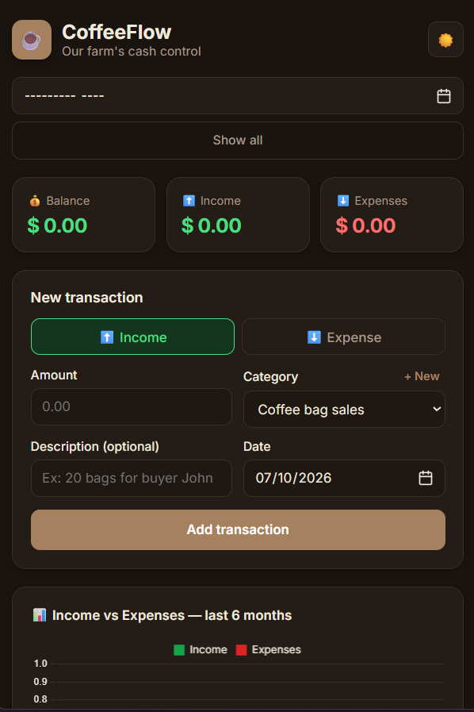

# ☕ CoffeeFlow

> A simple and practical financial management system designed to help organize the income and expenses of a coffee farming operation.


## 📌 About the Project

CoffeeFlow is a personal web application created to solve a real-world problem: keeping track of the financial activity of a small coffee farming operation.

Instead of relying on spreadsheets or scattered notes, the goal was to create a simple interface where income and expenses can be recorded, organized and visualized in one place.

This project was also an opportunity to practice building a complete CRUD application while focusing on usability, responsive design and clean code.

## 📸 Screenshot



*CoffeeFlow's main dashboard — balance summary, transaction form, and income vs. expenses chart.*

## ✨ Features

- Add income and expenses
- Edit existing transactions
- Delete transactions
- Categorize financial records
- View financial summaries
- Track income and expenses in one place
- Responsive interface
- Simple and intuitive user experience

## 🛠️ Technologies

- **HTML5** — semantic structure
- **CSS3** — responsive layout and styling
- **JavaScript (ES6+)** — application logic and DOM manipulation
- **Local Storage** — persistent data in the browser

## 🚀 How to Run

1. Clone the repository:
   ```bash
   git clone https://github.com/WennerNunes/Coffee-Flow.git
   ```

2. Navigate into the project folder:
   ```bash
   cd Coffee-Flow
   ```

3. Open `index.html` in your browser — or use an extension like Live Server in VS Code.

## 🎯 What I Practiced

This project helped me strengthen several important front-end development concepts:

- CRUD operations
- DOM manipulation
- JavaScript data structures
- Event handling
- Form validation
- Local Storage
- Responsive design
- UI/UX decisions
- Organising application logic
- Turning a real-world problem into a software solution

## 💡 Why I Built It

The idea came from a real situation rather than a fictional project.

My wife and I are involved in a small coffee farming operation, and managing financial entries and expenses manually can become difficult over time.

I wanted to build something simple enough to actually use, while also challenging myself to apply the front-end development concepts I have been learning.

For me, this project represents an important part of becoming a better developer:

**identifying a problem → understanding the requirements → designing a solution → building it → improving it.**

## 📱 Responsive Design

CoffeeFlow was designed to work across different screen sizes, making it possible to manage financial records from both desktop and mobile devices.

## 🚀 Future Improvements

- [ ] Data visualisation and financial charts
- [ ] Advanced filtering
- [ ] Monthly and yearly reports
- [ ] Export financial data
- [ ] Authentication
- [ ] Cloud database integration
- [ ] Backend API
- [ ] Multi-user support

## 👨‍💻 About Me

I'm **Wenner Nunes**, a Front-End Developer based in the UK, currently building my skills across modern web development.

I enjoy creating practical applications that solve real problems and continuously improving my understanding of software development.

### Connect with me

- 💼 [LinkedIn](https://www.linkedin.com/in/wenner-luiz-santana-nunes-122712205/)
- 🐙 [GitHub](https://github.com/WennerNunes)

## 📄 License

This project is licensed under the MIT License.

---

⭐ If you find this project interesting, feel free to explore the code and share your feedback.
